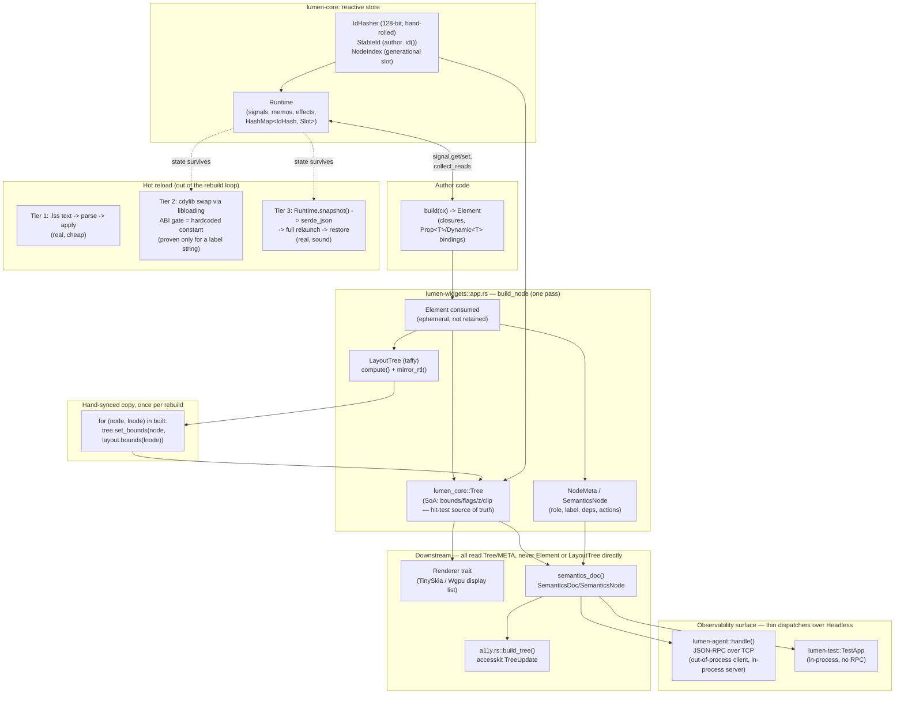

# 05 — Architecture Review (independent, adversarial)

*Scope: the conceptual design — component/reactivity model, identity, the
tree(s), agent-observability as architecture, hot reload, cross-platform,
safety, a11y, and what's missing for 1.0. Modularity/crate-boundary
mechanics, raw performance numbers, and consumer-API ergonomics are other
agents' lanes; they are touched here only where they bear on a design
decision. All claims below are checked against source, not against the
project's own docs, which the project's own audit already found ~30% drifted.*

---

## Verdict

Lumen's reactive core is real engineering, not vaporware: a hand-rolled
128-bit hashed identity scheme (`crates/lumen-core/src/identity.rs`), a
Solid-style fine-grained signal graph with dependency tracking
(`crates/lumen-core/src/state.rs`), and an agent/test surface that queries
the *same* live structures the renderer paints from, not a reconstruction.
That is a genuinely uncommon foundation for a GUI framework, and ADR-009
("semantic tree = a11y tree = locator tree = agent tree") is *actually true
in code*, verified independently — this is the project's strongest claim and
it holds up.

But the project's own newest self-measurement (`docs/results-node-cost-n0.md`,
2026-08-05) found that the fine-grained incremental path — the mechanism the
"top-tier performance" pillar and half the identity/reactivity machinery
exist to serve — is currently a **net pessimization**: rebuilding all 500
rows of a changed list is 1.44× *faster* and allocates 1.85× *less* than the
"optimized" path that memoizes 499 of them and patches one. The CP-series
plan that is supposed to fix this exists only as a design doc; nothing in it
is built yet. Tier-2 hot code reload — the mechanism advertised as swapping
`build()` logic in place — is proven in the repo only for a fixture that
swaps a static C-string label, with an "ABI compatibility hash" that is a
hardcoded constant on both sides rather than a real fingerprint of anything.
Cross-platform is desktop-primary in practice (1,929 lines in
`lumen-shell` vs. 136–380 in the mobile/web shells, no unifying platform
trait), and several core capabilities (real video decode, live
screen-reader verification, RTL-mixed text) are honestly marked
sandbox-blocked or unbuilt in the project's own backlog.

None of this is dishonesty — the project's internal plan documents (N-series,
RD-series retirement notices, `results-node-cost-n0.md`) are unusually candid
about exactly these gaps, more candid than most commercial codebases ever
are about their own load-bearing assumptions. That candor is itself evidence
the architecture is still in active, structurally-uncertain motion, not a
settled 1.0 design.

**Grade: B-.** The observability pillar is architecturally real and is a
genuine differentiator. The performance pillar's flagship mechanism is
currently self-measured as a net loss. The hot-reload pillar's hardest tier
is a proof-of-concept, not a load-bearing capability. Identity is well
designed at the hashing layer but has a live, unguarded footgun (same string
key, different type → silent corruption, then an unhelpful panic) that a
framework whose entire pitch is "an AI agent can trust what it queries"
cannot really afford.

**Is the "AI-first GUI framework" thesis architecturally realized? Yes, for
observability — no, for the other two pillars it's supposed to sit on top
of.** The agent does see what the app sees, by construction, not by a
side-channel that can drift. But "AI-first" was pitched as three co-equal
pillars (performance, observability, hot reload), and only one of the three
currently has the architecture it claims. A framework that is "an
observability-first GUI framework, with performance and hot-reload
work-in-progress" is a true and still-interesting sentence; "AI-first" as
currently marketed overclaims by two-thirds.

---

## Pillar scorecard

| Pillar | Grade | Evidence |
|---|---|---|
| **Performance architecture** | C | Reactive graph is real and dependency-tracked, but `docs/results-node-cost-n0.md` measured the incremental/memoized path as 1.44× *slower* and 1.85× more allocation-heavy than a full rebuild on the framework's own canonical benchmark shape (500-row list, 1 dirty row). Layout is not incremental at all — "taffy skip stands" (`.ai_docs/07-decision-log.md:400`) — every structural change relayouts the whole tree via a fresh `TaffyTree::compute` (`crates/lumen-widgets/src/app.rs:2593`). Paint-only patches (F3.4, background-only bindings) are genuinely surgical and do work as advertised. Net: the "surgical patch" story is true for a narrow slice (paint-only prop bindings) and false for the general case (any structural or text change), which is most real UI updates. |
| **Agent observability** | A- | Not a side channel: `crates/lumen-widgets/src/app.rs`'s `Headless<R,E>` is the one implementation both `lumen-agent::handle()` (`crates/lumen-agent/src/lib.rs:299`) and `lumen-test`'s `TestApp` call into. The RPC layer is a thin dispatcher, not a re-derivation. 30+ RPC verbs including layout bounds, ink/clip bounds, per-node reactive deps (`ui.getDeps`), reverse dependency index (`ui.whatDependsOn`), last-change diffing (`ui.lastChange`), geometry-free action invocation (`input.invokeAction`), and a lint pass (`ui.lint`). Real gaps below keep this from an A. |
| **Hot reload** | C+ | Tier 1 (`.lss`/asset push) is real, cheap, and works as documented (`crates/lumen-cli/src/dev.rs:33`). Tier 3 (snapshot restart) is real and sound — state crosses the reload boundary only as `serde_json`, never as raw pointers (`crates/lumen-cli/src/dev.rs:130-146`). Tier 2 (in-place code hot-patch) is architecturally sound *in the parts that are built* (leak-don't-unload old dylibs to avoid UAF; state never lives in the dylib) but its central safety gate — the "ABI hash" — is `pub const HOST_ABI_HASH: u64 = 0x1111_2222_3333_4444;` (`crates/lumen-cli/src/hotpatch.rs:17`), matched against an equally hardcoded constant in three fixture crates. It is not computed from anything (no compiler version, no struct-layout fingerprint, no crate hash). Worse, the one thing actually swapped across the FFI boundary in the only working demo is a `*const c_char` label string — not an `Element`-building closure. The real hard problem (moving `build(cx) -> Element` itself across a C ABI) is untouched. |

---

## System model (as found in code, not as documented)



Key honest facts this diagram encodes that the docs gloss over:

1. There is no persistent retained `Element` tree — `Element` is consumed
   during `build_node` (backlog.md's "E3 — `build_node` consumes the
   `Element`"). What *is* retained across pumps is `Tree` (SoA) + `NodeMeta`
   + the `LayoutTree`/taffy nodes, patched in place for paint-only bindings
   and otherwise rebuilt.
2. `Tree` (hit-test/paint source of truth) and `LayoutTree` (taffy) are two
   separate data structures built in lockstep during one pass and reconciled
   by an explicit copy loop (`crates/lumen-widgets/src/app.rs:2597-2599`),
   keyed by a `built: Vec<(NodeIndex, LayoutNode)>` correspondence vector.
   This is "hand-synced," just done systematically in one place rather than
   scattered — see Finding 3.
3. The agent and the headless test harness are not two implementations of
   introspection; they are two thin callers of one (`crates/lumen-widgets/src/app.rs`'s
   `Headless<R,E>`). The agent server does add a process boundary (TCP,
   `crates/lumen-cli/src/agent.rs`) for the live-window case, but the *data*
   crossing that boundary is read straight from the same `Tree`/`SemanticsDoc`
   the renderer painted from moments before, not re-derived.

---

## Architectural findings

Numbered by severity. Each: evidence, design consequence, corrective direction.

### F1 — [Critical] The flagship incremental-rebuild mechanism currently loses to doing nothing

**Evidence.** `docs/results-node-cost-n0.md`: `text_list_changed_frame` (500
nodes, all 500 dirty, full rebuild) = 776.2 µs / 2,952 allocs.
`text_list_scoped_changed_frame` (same shape, 1 dirty, using `cx.scope`
memoization exactly as the framework's own authoring guidance instructs) =
1,114.0 µs / 5,459 allocs — **44% slower, 85% more allocations**, for
*fewer* logical changes. `docs/plan-incremental-path.md:13-27` (the CP-series,
which superseded the retired N-series) confirms this is not a fluke: the
per-copied-node cost in `copy_node` (`app.rs:2731-2850` per that plan) does 4
`HashMap` removes + 4 inserts + a `LayoutStyle::clone()` + a fresh taffy node,
*per copied node*, which is more total work than just re-running the build
closure for that node.

**Design consequence.** ADR-007's stated payoff — "O(changed) updates" — is
false in the current implementation for the canonical workload the framework
tells authors to write (`cx.scope` around list rows). The reactive graph's
dependency tracking is real and correctly attributes changes (F0-F4 in the
decision log), but attribution correctness and cost-efficiency are different
properties, and only the first is delivered. An author who follows the
project's own guidance (memoize list rows with `cx.scope`) makes their app
slower, not faster. This is exactly the kind of gap that erodes trust in a
framework whose entire pitch is "the numbers are real."

**Corrective direction.** `docs/plan-incremental-path.md` (CP-series)
already diagnoses the three fixable cost sources and proposes carrying
forward only the one N-series idea with actual evidence (CP2.1, a hasher
swap). This is the right next move — but it is currently a plan, not code.
Nothing should cite "O(changed) updates" or "fine-grained reactivity" as a
*performance* property until CP-series lands and a benchmark shows the
scoped path beating the flat path. Until then, the fine-grained machinery's
honest value proposition is *observability* (dependency attribution for
`ui.getDeps`/`ui.whatDependsOn`), not speed — and the two should stop being
marketed as one pillar.

### F2 — [High] Tier-2 hot-patch's safety gate is not a real mechanism

**Evidence.** `crates/lumen-cli/src/hotpatch.rs:17`: `pub const
HOST_ABI_HASH: u64 = 0x1111_2222_3333_4444;` — a literal, not a computation.
The three fixture crates that are the only tested consumers
(`crates/fixtures/hot_a/src/lib.rs:6-8`, `hot_b/src/lib.rs:6-8`,
`hot_c/src/lib.rs:6-8`) hardcode the *same* literal (or a different literal
for the negative-path fixture) directly in their own source, with the
comment "ABI hash (compiler + core fingerprints, simulated)." There is no
code anywhere in the workspace (`rg -n "abi_hash|ABI_HASH"` outside these
four files returns nothing) that computes an ABI fingerprint from anything
real — not `rustc` version, not struct layout, not a crate content hash.
Rust has no stable ABI by default (`repr(Rust)` layout is not guaranteed
stable even between two builds with the same source and compiler), so a real
version of this gate is a genuinely hard problem this code does not attempt.

**Design consequence.** As shipped, Tier 2's "ABI mismatch → fall back to
Tier 3" safety net is a no-op for real components: two independently
compiled cdylibs from the same source at different points in time have no
mechanism forcing `lumen_abi_hash()` to disagree when their actual memory
layout has, in fact, diverged. If Tier 2 is ever pointed at anything beyond
the fixture harness, a routine `cargo build` that happens to change a struct
layout (adding a field, changing a generic's monomorphization, even a
codegen-units change) could load an incompatible dylib and call into it as
if it matched — undefined behavior, not a caught error. The demonstrated
"safety" is therefore untested for the actual risk it names.

**Additional finding within the same tier.** The only thing that crosses the
FFI boundary in the working demo is `lumen_build_label() -> *const c_char` —
a static string (`crates/fixtures/hot_a/src/lib.rs:12-14`). The host app in
`crates/lumen-cli/src/dev.rs:101-113` builds its own `Element` tree in-process
and merely *displays* the label fetched from the dylib. The advertised
capability — swapping `build(cx) -> Element` logic itself across the ABI
boundary — is not exercised anywhere in the test suite. This is a much
narrower proof than "component hot-patch works."

**Corrective direction.** Either (a) compute a real fingerprint (rustc
`-Z sha256-checksum`-class content hash of the component crate plus the
`RUSTC_VERSION`/target triple, refusing to swap on any mismatch, accepting
many false-negatives as the safe failure mode), or (b) stop calling this
"Tier 2 works" in any project communication until a fixture exercises an
actual `build(cx) -> Element` crossing the boundary and a deliberately
ABI-broken variant (e.g., reordered struct fields) is shown to be rejected.
Per ADR-014, a real Rust-aware hot-patching linker is explicitly out of v1
scope — which makes it more important, not less, that the interim mechanism
doesn't claim protection it doesn't have.

### F3 — [Medium] Same-key-different-type is silent corruption, not a caught error

**Evidence.** `docs/plan-state-keys.md:15-24` (K-series, current, unimplemented):
```
let a = rt.signal("x", || 0i32);
let b = rt.signal("x", || String::new());   // no complaint
b.set(&rt, "hello".into());                  // succeeds; slot now holds a String
a.get(&rt);                                  // panic: "signal type mismatch"
```
`signal_at` (`crates/lumen-core/src/state.rs:602`) returns a typed handle for
an existing slot without checking the type; `set_value` replaces the boxed
value wholesale. The panic that eventually surfaces carries no key name, no
expected type, no found type, and no diagnostic code.

**Design consequence.** This directly undercuts the identity design's own
stated invariant. `IdHash` is deliberately 128-bit specifically because "a
collision would silently alias two signals" (`crates/lumen-core/src/identity.rs:18-21`)
— the *hash* collision risk is engineered to ~0. But the *type* collision at
a shared key is not guarded at all, and is reachable through completely
ordinary usage (two widgets, or two versions of one widget across a hot
reload, addressing `"x"` with different intended types). For a framework
whose defining claim is that an AI agent can trust the state it queries,
"silently corrupts, then panics uninformatively, elsewhere" is close to the
worst failure shape available — it fails far from its cause, exactly where
an agent's fault attribution is weakest.

**Corrective direction.** `docs/plan-state-keys.md` already has this
scoped and distinguishes it correctly from the *legitimate* same-key
same-type sharing pattern widgets rely on (`{name}.open` etc.) — it should
ship before this is called production-ready, with a diagnostic that names
the key, both types, and (ideally) both call sites.

### F4 — [Medium] Tree/LayoutTree reconciliation is a hand-maintained invariant, not a structural guarantee

**Evidence.** `crates/lumen-widgets/src/app.rs:2579-2599`: `build_node`
populates a `lumen_core::Tree` (SoA hit-test/paint source of truth per
`crates/lumen-core/src/tree.rs:13-14`) and a separate `LayoutTree` (taffy
wrapper) in one pass, collecting `built: Vec<(NodeIndex, LayoutNode)>`; after
`layout.compute(...)`, bounds are copied node-by-node from the taffy result
into the SoA tree by iterating `built`. The correctness of the whole
downstream stack — hit-testing, semantics, `ui.getLayout`, screenshots —
depends on `built` containing exactly one correctly-paired entry per node,
constructed correctly by every code path that calls into `build_node`
(including the F3.4 patch path, which does *not* go through this loop — see
`patch_bg_bindings`, `app.rs:2356-2381` — and therefore must independently
guarantee it never touches size-affecting properties).

**Design consequence.** This is exactly the "hand-synced trees" pattern the
review brief warned about — done more disciplined than a typical accretion
(one function owns the whole reconciliation, not scattered call sites), but
still a manually-maintained bijection with no type-level enforcement. A
future contributor adding a node-producing code path that doesn't push into
`built` produces stale/zeroed bounds for that node silently (`Tree::bounds`
returns `Rect::ZERO` for a missing index rather than panicking —
`crates/lumen-core/src/tree.rs:180-185` — which is the right choice for
crash-safety but the wrong choice for surfacing this exact bug class).

**Corrective direction.** A debug-assertion pass (already partially present
via the F0 coherence oracle mentioned in the decision log) that every live
`Tree` node has a corresponding `LayoutTree` entry after each `rebuild`/
`patch`, gated into CI, would convert a silent drift into a loud test
failure. This is cheap relative to the risk.

### F5 — [Medium] `catch_unwind` + `AssertUnwindSafe` is used as normal control flow, twice, without a torn-state audit

**Evidence.** Whole-app: `crates/lumen-widgets/src/app.rs:2386-2387`
(`rebuild`, wraps `rebuild_inner`). Per-subtree: `crates/lumen-widgets/src/boundary.rs:16`
(`error_boundary`). Both use `AssertUnwindSafe`, which exists specifically to
*suppress* the compiler's `UnwindSafe` check — the check that would normally
stop you from wrapping a closure that mutates shared state (here: the
`Runtime`'s signal store, via interior mutability) in `catch_unwind` without
proving it's safe to resume after.

**Design consequence.** `RefCell` doesn't poison on panic (unlike
`std::sync::Mutex`), so this won't deadlock or hard-panic-on-panic. The real
risk is logical: a widget's `build` closure that performs multiple
`signal.set` calls (or a multi-step mutation via `update`) and panics
partway through leaves the store in whatever partial state existed at the
panic point, and both the top-level and subtree boundary happily continue
running against that partial state on the next pump. Nothing in the code
audited enforces "signal mutations during a single scope run are atomic" —
there's no batching-as-safety-net for the panic path specifically (`batch`,
`state.rs:738`, exists for write-coalescing, not rollback). For error
boundaries used as intended — isolating a buggy leaf widget — this is a
minor risk. For the top-level `rebuild` catch, which is supposed to keep the
*entire app* alive after *any* panic anywhere in the tree, it means a panic
in widget A can leave state that widget B reads into an inconsistent shape,
silently, with no diagnostic tying the two together.

**Corrective direction.** Either document the actual guarantee precisely
("state may be partially mutated after a caught build panic; only the
*tree* is guaranteed consistent, not application state") rather than
implying general safety, or add transactional semantics to the write path
specifically for the panic-recovery case (e.g., a generation-stamped
rollback of writes since the last successful `rebuild`/`pump` boundary).

### F6 — [Low-Medium] Agent can see the winning style rule, not the cascade decision

**Evidence.** `ui.getStyles` (`crates/lumen-agent/src/lib.rs:323`, backed by
`crates/lumen-widgets/src/app.rs:2947-2971`) returns, per property, the
already-resolved `computed_json_spanned(value, origin, span)` — the winning
value plus where it came from. There is no code path that returns the
*losing* candidates (rules that matched the selector but lost on
specificity/order) or *why* a written rule in the author's `.lss` didn't
apply (selector didn't match at all vs. matched-but-overridden vs. property
unsupported by the runtime — the last of which is a real, documented
category per the `styling-lss` skill: "the parser accepts far more than the
runtime applies"). An agent debugging "I wrote `color: red` and nothing
changed" gets the final color, not the reason.

**Design consequence.** This is the single largest gap between "complete
observability" as marketed and what's queryable today. It's also the
single most common real debugging need (per the `debugging-lumen` skill's
own symptom list: "a `.lss` rule seems ignored").

**Corrective direction.** `ui.getStyles` already has `origin`/`span` per
matched property — extending the cascade evaluator to also record rejected
candidates (selector, specificity, why it lost) is additive to that
existing data structure, not a new subsystem.

### F7 — [Low] Cross-platform is a documented aspiration over a desktop-shaped implementation

**Evidence.** Line counts: `crates/lumen-shell/src/lib.rs` = 1,929;
`crates/lumen-shell-android/src/imp.rs` + `lib.rs` = 379;
`crates/lumen-shell-ios/src/lib.rs` = 136; `crates/lumen-shell-web/src/lib.rs`
= 230. There is no `trait Platform`/`trait Shell` implemented across all
four — `grep -n "pub trait"` in these crates finds only `RunExt` in
`lumen-shell` and rendering-side traits (`Renderer`, `VideoSource`) in
`lumen-render`, not a platform-abstraction seam. Platform differences are
instead threaded through shared crates via scattered `#[cfg(target_arch =
"wasm32")]` (10+ sites across `lumen-core`, `lumen-render`, `lumen-agent`,
`lumen-widgets`) and `#[cfg(target_os = ...)]`, i.e., conditional compilation
inside otherwise-shared code rather than one abstraction boundary each
platform shell implements against.

**Design consequence.** This is a legitimate strategy (many successful
cross-platform Rust GUI projects do exactly this), and it is honestly
reflected in the project's own backlog — D4 ("web + mobile shell parity") is
listed sandbox-blocked, A5 (AccessKit *live* screen-reader verification) is
sandbox-blocked, D2 (real audio/video codecs) is sandbox-blocked. The risk
is not that mobile/web are behind — it's that there is no architectural seam
forcing parity to be checked structurally (a trait every shell must
implement, with a conformance test suite run per-platform); parity is
currently a matter of discipline and backlog tracking, not a compile-time
guarantee.

### F8 — [Low] `mirror_rtl` handles box direction; mixed-direction text runs are unverified

**Evidence.** `crates/lumen-layout/src/tree.rs:110-125` mirrors box
positions for RTL locales (real, exercised via `Headless::set_rtl`). Text
*shaping* for mixed-direction runs (Arabic quoted inside an English
sentence, or vice versa) depends on `parley`'s own bidi handling (see
project memory: "parley 0.11 upgrade — needs complex-scripts for CJK"), and
no golden test asserting correct mixed-direction glyph ordering was found in
this pass (absence of evidence, not evidence of absence — worth a follow-up
check by whoever owns text/rendering).

---

## Agent-observability blind spots

This is the section the review brief calls most valuable — an honest list of
what an AI agent driving Lumen through `lumen-agent`/`lumen-test` *cannot*
currently see or do, each with why it matters.

1. **Why a style rule lost the cascade** (F6 above). The agent gets the
   winning value with origin/span; it cannot see rejected candidates or
   distinguish "selector didn't match" from "matched but a higher-specificity
   rule won" from "the property isn't implemented by the runtime at all." This
   last category is real and documented (`styling-lss` skill) — an agent has
   no RPC-level way to detect it and will keep re-trying a property the parser
   silently accepts but the renderer never draws.

2. **Why a click did nothing, beyond "nothing changed."** `ui.lastChange`
   reports `idle`/`patch`/`rebuild` after a pump, and `input.invokeAction`
   bypasses hit-testing entirely by running a retained handler directly — which
   is great for reliable actuation but means there is no RPC path that reports
   *hit-test* failure reasons for a coordinate-based click (`input.click`):
   was there no node at that point, was it clipped, was it not
   `HIT_TESTABLE`, was it occluded by a higher-`z` sibling? `Tree::hit_test`
   (`crates/lumen-core/src/tree.rs:253`) has all of this information
   internally; none of it is surfaced when a click resolves to "nothing."

3. **Event routing / bubbling trace.** There is no RPC verb that returns "this
   event was dispatched to node X, then bubbled to Y, was it stopped, by
   what handler." An agent can only infer routing from before/after tree
   diffs.

4. **Layout *reasoning*, only layout *results*.** `ui.getLayout` returns
   final bounds, ink bounds, clip status, and text metrics
   (`crates/lumen-agent/src/lib.rs:333-361`) — genuinely rich. It does not
   return *why* those bounds resulted (which flex/grid constraint bound the
   width, whether a child was compressed below its intrinsic size, whether a
   text node overflowed and was clipped by an ancestor vs. its own box, beyond
   the single derived `clipped: bool`). Taffy has this reasoning internally;
   none of it crosses the RPC boundary.

5. **Animation/transition state mid-flight.** `motion::spring` primitives and
   gesture-driven interactions exist, but no RPC verb was found for querying
   "is an animation currently running on node X, what's its progress,
   when will it settle" beyond `ui.waitSettled`'s pass/fail. An agent
   scripting a UI test against an in-flight transition has to poll
   screenshots, not query state.

6. **IME composition state.** Text input has real IME wiring (project memory:
   "real modifiers + IME wired in the shell") but no RPC verb surfaces
   mid-composition state (candidate text, composition range) — an agent
   testing CJK/IME-driven input flows is blind to the intermediate state, only
   to the committed result.

7. **Focus/hover/drag state is inferable but not directly queryable as a
   named concept.** `NodeFlags::FOCUSED/HOVERED/PRESSED` exist internally
   (`crates/lumen-core/src/tree.rs:33-44`); `ui.getTree`/`ui.getStyles` expose
   states indirectly via the semantics `states` field, but there's no single
   "what currently has focus / what's under the pointer / what's mid-drag"
   verb — an agent has to walk the tree and filter, which works but is
   O(tree) per query rather than O(1).

8. **Panics are logged, not structurally attributed.** `app.logs`/
   `app.diagnostics` surface the `E0701` build-panic message
   (`crates/lumen-widgets/src/app.rs:2415-2419`), but a panic inside a
   subtree `error_boundary` (`boundary.rs`) — the *intended*, contained
   failure mode — was not found wired to any RPC-visible diagnostic at all;
   it renders a fallback element silently. An agent watching only
   `app.diagnostics`/`app.logs` can miss that a subtree is degraded unless it
   also greps rendered text for the fallback's "⚠" marker.

9. **Live AccessKit tree is unverifiable from the agent surface.** The
   headless `semantics_json` is real and rich, but the actual `accesskit`
   `TreeUpdate` that a real screen reader consumes (`crates/lumen-widgets/src/a11y.rs`)
   is only reachable through a live AT (Orca/NVDA/VoiceOver) per the
   project's own backlog (A5, sandbox-blocked) — there's no RPC verb to fetch
   the *built* AccessKit tree for diffing against `semantics_json`
   programmatically, only a manual-verification checklist
   (`docs/a11y-checklist.md`).

10. **Reactive-dependency verbs are gated behind `snapshot` feature and are
    per-node, not global.** `ui.getDeps`/`ui.whatDependsOn` are
    `#[cfg(feature = "snapshot")]`-only (`crates/lumen-widgets/src/app.rs:2977`,
    `3006`) — a lean/no-default-features build (the one recommended for
    shipped binaries per ADR-011/ADR-003) has *no* agent introspection at all,
    by design ("a lean build implies no agent," decision log 2026-07-02). An
    agent can only introspect dev builds, never the shape of what ships. Also,
    per the F4 decision-log entry's own caveat: "root-level reads not inside a
    scope/binding aren't attributed to a node, so they don't appear" in
    `ui.whatDependsOn` — global/root state changes are invisible to this verb.

11. **No structured tree-diff verb.** `ui.getTree`/`ui.lastChange` together
    let an agent infer what changed (full tree, or a `patch` node-id list for
    the surgical path, or "rebuild happened, no per-node diff" for the
    non-surgical path — explicitly noted as "per-node diff deferred" in the
    F4 decision-log entry). For the common case (a structural rebuild), the
    agent's only recourse is diffing two full `ui.getTree` snapshots itself.

---

## Hot-reload reality check

| Tier | Claims | What's actually built | Cost | What breaks |
|---|---|---|---|---|
| **1 — style/asset** | `.lss`/`.wgsl`/assets, ~1 frame, zero risk | Real. `notify`-based file watcher (`crates/lumen-cli/src/dev.rs:15-29`) → parse → `set_stylesheet` (`crates/lumen-widgets/src/app.rs:2872`). Failed parse keeps old stylesheet + emits diagnostics. | Cheap; parse-only latency measured in the reload result (`ReloadResult.duration_ms`). | Nothing structural found; this tier is as advertised. |
| **2 — code hot-patch** | Swap `build()` logic via `cdylib`, ~0.5–2s, state preserved | Mechanism (leak-not-unload, state-outside-dylib) is sound in principle. ABI gate is a hardcoded constant on both sides (F2) — not a real check. Only demonstrated payload is a static label string, not an `Element`-producing closure. | Test-measured swap itself is sub-2s for the toy fixture (`crates/lumen-cli/tests/hotpatch.rs:65`), but this measures `libloading::Library::new` + a symbol call, not a real component rebuild+swap. | For anything beyond the fixture: an incompatible layout change would silently "succeed" rather than correctly fall back to Tier 3, because nothing computes a real incompatibility signal. This is the tier most likely to bite a real user first. |
| **3 — snapshot restart** | Full serialize/relaunch/rehydrate, ~2–5s | Real and sound. `Runtime::snapshot()` → `serde_json` (ADR-011: deliberately not a binary format, so it survives struct evolution) → fresh `run_headless_restored` → diagnostics for dropped/incompatible values (`crates/lumen-cli/src/dev.rs:130-144`). | Pays for a full rebuild + JSON round-trip; acceptable for the stated use (ABI-crossing changes, presumably rare). | Value types that don't round-trip through `serde_json` (or whose shape changed incompatibly) are dropped with a `W0002`-class diagnostic — a real, bounded failure mode, not silent. |

**Net:** two of three tiers are solid; the one in the middle — the one that
actually delivers on "change my Rust logic without losing state, subsecond"
— is the one that isn't proven for real code yet. Given ADR-014 explicitly
punts the *hard* version of this (a real hot-patching linker) to a future
project, Tier 2 as it stands is best understood as scaffolding for that
future project's contract (the `Checkpoint` protocol), not as a delivered
capability today. It should not be marketed as delivered.

---

## Missing seams for 1.0

| Capability | Status | Evidence |
|---|---|---|
| i18n (message catalogs, plurals, locale numbers) | **Present, real** | `crates/lumen-widgets/src/i18n.rs` — Fluent-style catalogs, CLDR-ish plural categories, `W0401` for missing keys. |
| RTL layout mirroring | **Present, real** | `crates/lumen-layout/src/tree.rs:110-125` (`mirror_rtl`), driven by `Headless::set_rtl`. |
| RTL/bidi *text shaping* (mixed-direction runs) | **Unverified** | No golden test found asserting mixed-direction glyph order; depends entirely on `parley`'s bidi handling, unaudited here (F8). |
| Multi-line / rich text editing | **Partial** | `crates/lumen-widgets/src/text_input.rs` supports caret, selection, clipboard, undo/redo, and `multiline` mode (line 325). No evidence found of *styled* (multi-run/rich) in-place editing — only plain-text buffers. |
| Video/media playback | **Stub only** | `crates/lumen-render/src/media.rs` ships a deterministic *test-pattern* generator (`TestPattern`, a procedural gradient) for golden-test determinism, explicitly not real decode: "Hardware-accelerated video decode … tracked separately." Matches backlog D2 (sandbox-blocked). |
| Plugin / third-party widget extension system | **Missing** | `rg -il plugin` only matches CLI scaffolding (`lumen-cli`'s own subcommand help text), not a widget-registration or extension-point API. |
| Runtime theming (swap theme without restart) | **Present** | `Headless::set_stylesheet` (`crates/lumen-widgets/src/app.rs:2872`) is exactly this seam, reusing the Tier-1 reload path — a real, if implicit, "hot theme swap" capability. |
| Multi-window | **Present, real** | `.window()` API + `WindowDesc` (`crates/lumen-widgets/src/app.rs:113, 1619`), backlog P.3d marked done with live pixel-propagation verification; per-window agent verbs still pending. |
| Drag-and-drop (in-app) | **Present** | `on_drag` handlers, `drag_surface`/`drag_fraction` (`crates/lumen-widgets/src/motion.rs:174-183`), used by `Slider`/`PaneGrid`. |
| Drag-and-drop (OS-level) | **Present per backlog** | Backlog P.3e marks OS drag-and-drop done; `Event::Drop` exists (`crates/lumen-core/src/events.rs:251-257`). Not independently re-verified in this pass. |
| Virtualized/windowed large lists | **Present, real, load-tested** | `vlist`/datagrid virtualization exercised at `1m`-row scale in the framework's own benchmarks (`vlist_1m_scroll`, `data_grid_1m_scroll` in `docs/results-node-cost-n0.md`). |
| Animation composition (sequencing, interruption, physics) | **Basic only** | `motion::spring` primitive exists; "gesture-driven interruptible animations + shared-element transitions" is explicitly listed as *not yet built* follow-on work (backlog "D1 motion"). No sequencing/choreography API found. |
| Accessibility beyond basic roles/states | **Structurally sound, unverified live** | Role/state mapping is an exhaustive match (compile-fails on a new unmapped role) — `crates/lumen-widgets/src/a11y.rs:13-46`. Live AT verification (actual NVDA/Orca/VoiceOver) is explicitly sandbox-blocked (backlog A5); the only verified claim is headless `semantics_json` matches what's *fed into* AccessKit, not that assistive tech renders it correctly. |

---

## Risk register

| # | Decision | Probability of forcing a painful rewrite | Impact if it does | Why |
|---|---|---|---|---|
| 1 | Fine-grained incremental path stays a net pessimization | **Medium** | **High** | If CP-series can't actually beat the flat-rebuild baseline (not yet proven — it's a plan, not a result), the entire identity/scope/binding machinery (ADR-007/013/021, thousands of lines) becomes pure-observability infrastructure carrying a performance *cost* rather than benefit, and the "top-tier performance" pillar has no mechanism left to stand on except paint-only patching. |
| 2 | Tier-2 hot-patch's ABI gate stays a stub | **Medium-High** (if anyone tries to use Tier 2 for real components before fixing this) | **High** (memory-unsafety-class bug, not a design smell) | A real component-boundary ABI check for Rust is a hard, possibly research-grade problem (no stable ABI). If the team discovers this only after users hit UB from a "safe" hot-swap, the fix (walking back to conservative always-Tier-3, or investing in a real fingerprint scheme) is a trust-damaging retreat, not a quiet patch. |
| 3 | No unifying platform trait for shells | **Low-Medium** | **Medium** | Cheap to defer today (desktop-first is a reasonable v1 bet), but retrofitting a trait after web/mobile shells have each grown their own ad hoc surface (as `lumen-shell-web`/`-android`/`-ios` are already doing independently) gets more expensive every quarter mobile/web stay "sandbox-blocked" rather than actively developed against a shared contract. |
| 4 | Layout stays non-incremental (full `taffy` recompute every structural change) | **Low** | **Medium** | N0 measured taffy at only ~8% of a changed frame today, so this isn't urgent — but it caps how far the "fine-grained" story can ever go: paint-only patches are surgical, but *any* text/size-affecting change relayouts everything, always. If apps grow toward the "10k-node tree" scale the R4 plan already anticipated, this becomes the bottleneck the current architecture has no incremental answer for (R4/multi-threaded layout is parked, not solved). |
| 5 | String-keyed state (`"x"`) coexists with typed hashed identity, with no type-safety net | **Medium** | **Medium** | K-series (plan-state-keys.md) already scopes the fix; the risk is only in *not* shipping it before more of the widget ecosystem grows around the unguarded pattern, at which point the fix has more call sites to touch. |
| 6 | `catch_unwind`-as-architecture with no transactional write guarantee | **Low** | **Medium** | Rare in practice (requires a panic mid-multi-write), but the failure mode when it does occur (silently inconsistent app state surviving past the panic) is exactly the kind of bug that's brutal to reproduce and that erodes an AI agent's ability to trust "the tree I'm querying is coherent." |

---

## Strategic recommendation — 3 architectural moves for the next 6 months

1. **Ship CP-series (`docs/plan-incremental-path.md`) and re-baseline every
   performance claim on its result, not on ADR-007's original O(changed)
   promise.** This is the single highest-leverage move: it's already
   scoped, it's already diagnosed down to specific line ranges
   (`copy_node`, `app.rs:2731-2850`), and until it lands, "top-tier runtime
   performance" and "fine-grained reactivity" are two different claims
   pointing at the same currently-broken mechanism. If CP-series *also*
   fails to beat the flat rebuild after implementation, that is itself the
   most important finding the project could produce next — it would mean
   the retained-graph model needs to be reconsidered at the ADR level, not
   patched.

2. **Replace the Tier-2 ABI gate with something real, or retire Tier-2's
   "state-preserving in-place swap" claim until it is.** Concretely: either
   invest in a genuine per-symbol/per-struct-layout fingerprint (even a
   conservative one that produces frequent false-negatives — refusing to
   hot-swap when it isn't sure — is vastly safer than the current always-true
   gate), or change the documented behavior of Tier 2 to "always falls back
   to Tier 3" until that fingerprint exists, so the *safe* tier (snapshot
   restart, which is genuinely sound) is what ships as the default, and Tier
   2 stays an opt-in experiment clearly labeled as such. Shipping UB behind a
   "safe fallback" that doesn't actually fall back is the highest-severity
   item in this whole review.

3. **Close the two biggest agent-observability gaps that are cheap relative
   to their value: cascade-rejection reasoning in `ui.getStyles` (F6) and
   hit-test-miss reasoning for `input.click` (blind spot #2).** Both extend
   data structures that already exist (`computed_json_spanned`'s
   origin/span; `Tree::hit_test`'s internal candidate walk) rather than
   requiring new subsystems, and both map directly onto the single most
   common class of "why didn't my UI change" and "why did my click do
   nothing" debugging sessions per the project's own `debugging-lumen`
   skill. This is the pillar that's actually working architecturally —
   investing here compounds the project's real differentiator instead of
   chasing the two pillars still under construction.
